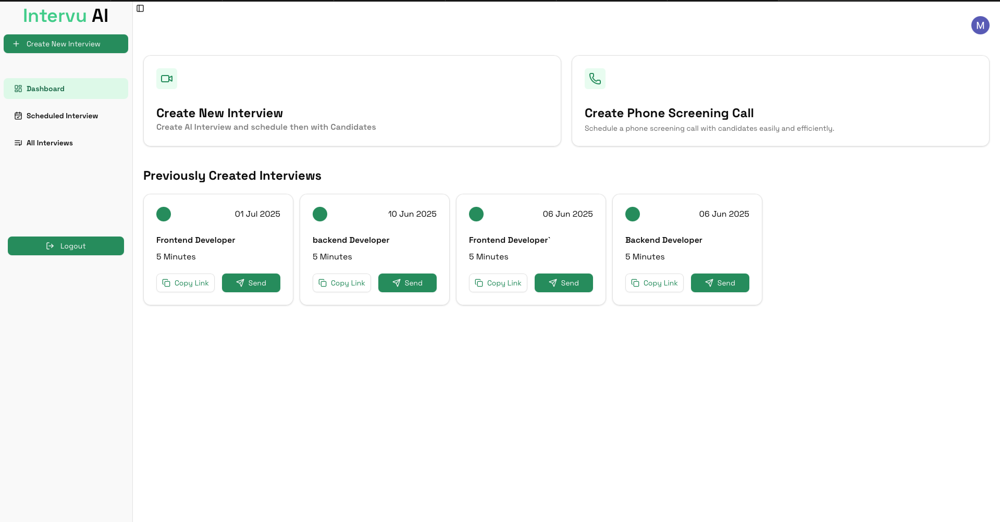
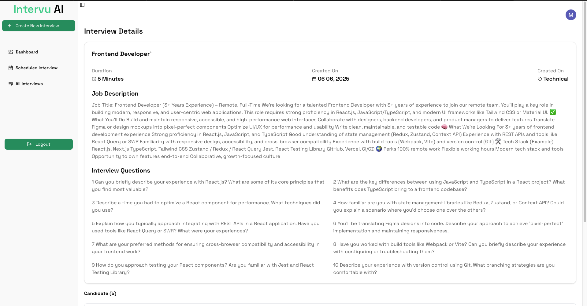
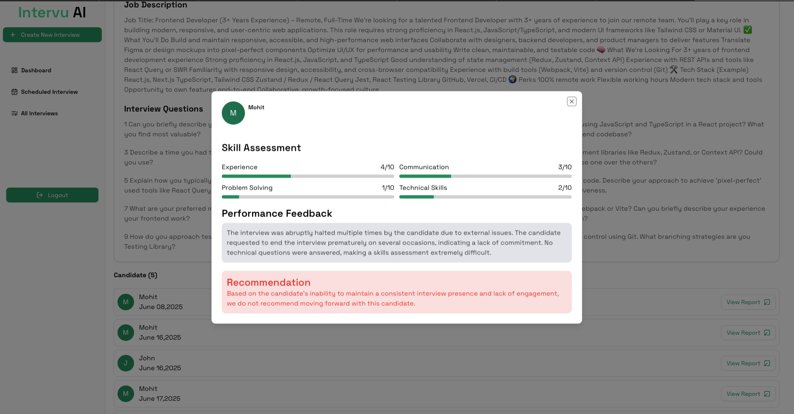

# Intervu AI

**Intervu AI** is an AI-powered mock interview platform designed to help developers and job seekers practice technical interviews in an interactive environment.

The platform simulates real interview scenarios by generating interview questions and evaluating responses using AI, helping users improve their problem-solving and communication skills.

---

# Overview

Preparing for technical interviews can be challenging. **Intervu AI** simplifies this process by providing an AI-powered environment where users can practice answering interview questions and receive intelligent feedback.

The platform helps users:

- Practice mock interviews
- Improve response quality
- Gain confidence before real interviews
- Simulate realistic interview experiences

---

# Demo Screenshots

## Dashboard

Shows previously created interviews and allows quick access to manage or schedule interviews.

---

## Interview Details

Displays the interview configuration, job description, and generated interview questions.

---

## Candidate Skill Assessment

AI evaluates candidate responses and generates a performance report including skill scoring and recommendations.

---

# Features

## AI Generated Interview Questions

Generate interview questions based on:

- Job role
- Technology stack
- Difficulty level

---

## Interactive Interview Sessions

Users can go through interview questions step-by-step and respond as they would in a real interview.

---

## AI Feedback System

The AI evaluates answers and provides insights such as:

- clarity of explanation
- completeness of answer
- improvement suggestions

---

## Interview Management

Create and manage multiple interviews including:

- scheduling interviews
- sharing interview links
- tracking interview sessions

---

## Clean and Modern UI

A simple and intuitive interface that allows users to focus on practicing interviews without distractions.

---

# Tech Stack

### Frontend

- React / Next.js
- TypeScript
- Tailwind CSS
- Modern UI components

### Backend

- Node.js
- API routes

### AI Integration

- LLM based question generation
- AI response evaluation

---

# Project Structure
